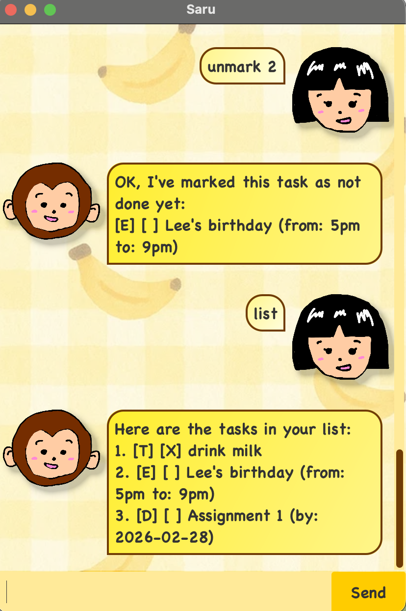

# 🐒 Saru User Guide 🐒


Saru is your personal scheduling monkey that helps you manage tasks quickly using simple commands.


## 📌 Features

## ➕ Adding Tasks
Adds a new task to your task list.
### 📝 To-dos
Adds a task without a date.
Command format: `todo <task name>`
Alias: `t <task name>`
Example: 
```
todo eat banana
t do homework
```
### 🎈 Events
Adds a task with a start and end time.
**Command format:**
- `event <task name> /from <yyyy-mm-dd> /to <yyyy-mm-dd>`
- `event <task name> /from <yyyy-mm-dd HHmm> /to <yyyy-mm-dd HHmm>`

**Alias:**
- `e <task name> /from <yyyy-mm-dd> /to <yyyy-mm-dd>`
- `e <task name> /from <yyyy-mm-dd HHmm> /to <yyyy-mm-dd HHmm>`
Example:
```
event Lee's birthday party /from 2026-02-20 1100 /to 2026-02-20 1630
e house camp /from 2026-02-03 /to 2026-02-05
```
### 📅 Deadlines
Adds a task with a due date.
Command format: `deadline <task name> /by <yyyy-mm-dd>`
Alias: `d <task name> /by <yyyy-mm-dd>`
Example:
```
deadline submit report /by 2026-02-03
d pay rent /by 2026-07-05
```

## ❌ Deleting Tasks
Deletes a task by its index number.
Command format: `delete <task number>`
Alias: `rm <task number>`
Example:
```
delete 2
rm 1
```
## ✅ Marking Tasks 
Marks tasks as done or undone using the task index.
### Mark as Done
Command format: `mark <task number>`
Alias: `m <task number>`
Example:
```
mark 1
m 3
```
### Mark as Undone
Command format: `unmark <task number>`
Alias: t: `um <task number>`
```
unmark 2
um 5
```
## ❌ Finding Tasks
Searches your task list and displays tasks whose descriptions contain the given keyword.
Command format: `find <keyword>`
Alias: `f <keyword>`
Example:
```
find banana
f meeting
```
Saru will display all matching tasks. If no tasks match, Saru will inform you that no matches were found.

## Viewing Tasks
Displays all tasks in the task list.
Command format: `list`
Alias: `ls`
Example:
```
list
ls
```

## 🚪 Exiting the Application
Exits the application safely.
Command format: `bye`
Alias: `q`
Example:
```
bye
q
```
When this command is entered, Saru will display a goodbye message and close the application.

## ⚠ Notes
* Task numbers refer to the index shown in the task list.
* Dates for deadlines must follow the format `yyyy-mm-dd`.
* If an invalid command is entered, Saru will prompt the user to enter a valid command.